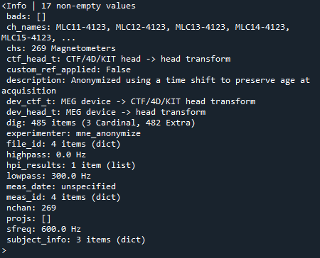
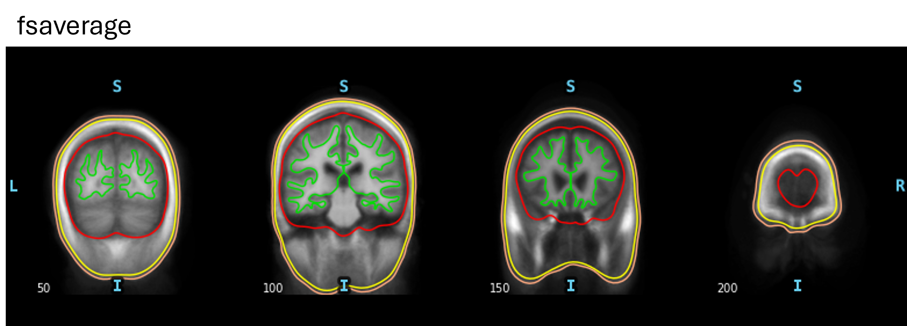
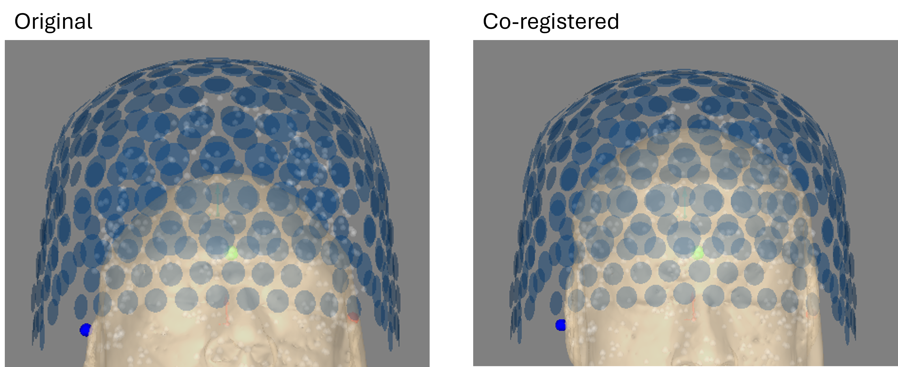
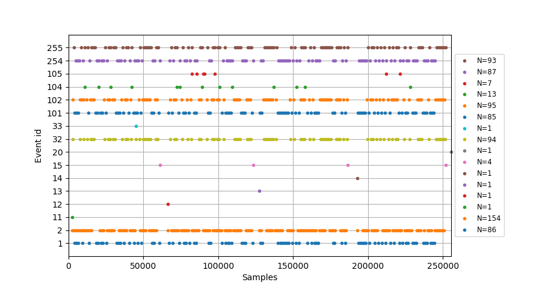
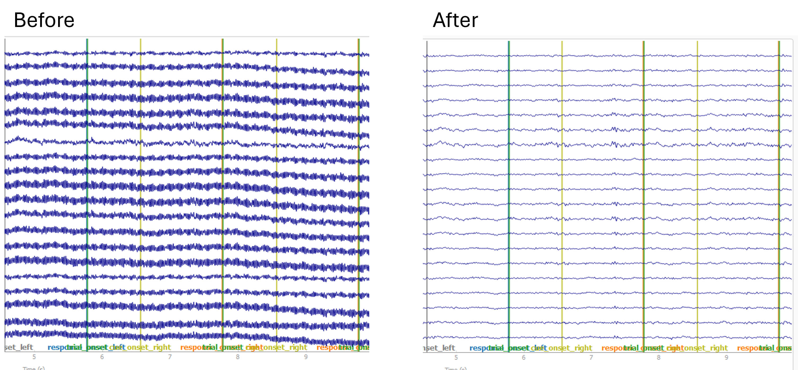
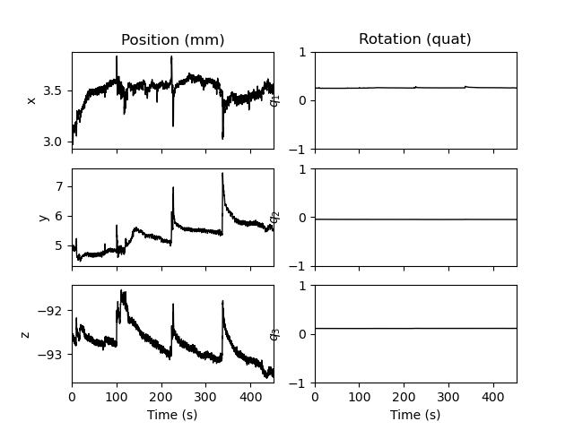
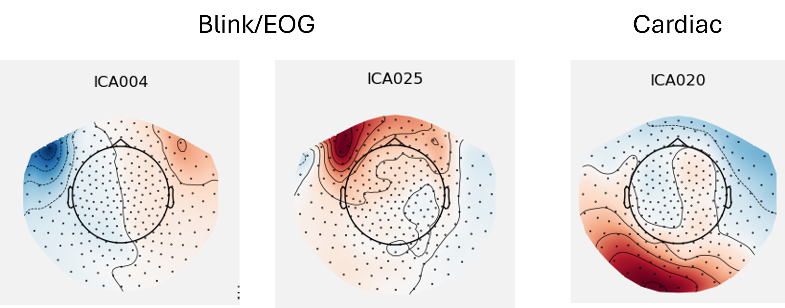

# Source Reconstruction of Induced MEG Responses using an LCMV Beamformer
This pipeline is used to analyse CTF MEG data taken in Nottingham (SPMIC). Pre-processing, forward modelling, and source reconstruction are separated into three scripts which have each been written to allow for easy automation, e.g. running through bash. Data are already converted into BIDS here - this is easy to implement using MNE-BIDS functionality (https://mne.tools/mne-bids/stable/generated/mne_bids.write_raw_bids.html), but also easy to remove if not using BIDS format. The below describes each script in a lot of detail to allow easy usage by non-experienced programmers/scientists.

## Forward Modelling
The components required for a MEG forward model are:
1) A segmented MRI, produced using FreeSurfer (see FreeSurfer section)
2) A transformation matrix (`trans`) that is used to map the segmented MRI to the space defined by the MEG sensors (often called co-registration)
3) A source-space (`src`), which is a set of coordinates within the segmented MRI that will be used to model magnetic dipoles
4) A conduction model (`bem`), which uses the segmented MRI to estimate field conduction through the head volume. 

A forward solution is then calculated using the above components. The outcome is a set of *lead fields* (`fwd`), which estimate how fields produced by dipoles at each of the source-space coordinates project onto the array of sensors.

The following sections will describe how each of these components are produced using the `1_forward_model.py` script.

Before beginning, note the line in the first section of the script:
`mne.viz.set_3d_options(depth_peeling=False, antialias=False)`
This seems to enable all the 3D plotting within MNE - without this line some of the features don't work properly on some computers.

#### Setting up paths
In this pipeline we use BIDS paths (directory trees containing all *subjects* and *sessions* in your dataset, with specific naming format) containing the data, as well as a separate BIDS path for *derivatives*, i.e., data that has been processed in some way. These folder structures are set using the `mne_bids` function `BIDSPath`, which requires the user to set values for `subject` (e.g. '05'), `session` (e.g. '01'), `task` (e.g. 'CRT', which stands for choice-reaction-time), `run` (e.g. '01') and `suffix` (often meaning the modality, e.g. 'meg'). A folder structure using the above examples would go as **"...BIDS_root\sub-05\ses-01\meg"** and an example file name in the folder would go as **"sub-2002_ses-03N_task-EmoFace_run-01_meg.fif"**.

Whenever we save objects out, they must be saved into the derivatives BIDS path, e.g. **"...derivatives_root\sub-05\ses-01\meg"**, **not** the data BIDS path. This can easily be replaced with your own paths if not using BIDS format by simply setting `data_path = r"path\to\your\data"`. 

#### Loading data
Data is loaded from the BIDS paths using `read_raw_bids` from the mne_bids package. For forward modelling, We are only using this data for the `info` object, containing meta-data stored in the MEG dataset. The info object can be simply obtained by typing `data.info`. Specifically, this info object is required because it contains a *montage*, i.e., a set of 3D coordinates corresponding to sensor locations, HPI coil locations, and digitised headshape points (taken using a polhemus or other digitisation methods). If you run `data.info`, you should see a line among the outputs that looks something like *"dig: 385 items (3 Cardinal, 482 Extra)"*, meaning the montage contains a digitisation of three HPI coils (used as fiducial markers) and 482 headshape points.

#### Load FreeSurfer Files
Next we load the outputs from FreeSurfer. These are contained in the `subjects_dir` directory. For more information on this, see the README file in **freesurfer_recon**. If you have a FreeSurfer reconstruction for the subject, set `subjects_dir = r"path\to\your\freesurfer\subjects_dir"` and then set `fs_subject` to a string corresponding to the name of the subject folder in `subjects_dir`, e.g. "sub-01". If you do not have a FreeSurfer reconstruction for the subject MRI, set `subjects_dir = op.dirname(mne.datasets.fetch_fsaverage(verbose=True))`, and set `fs_subject = "fsaverage"`, which allows you to use a template freesurfer reconstruction from the MNI-152 brain. However, note that **fsaverage should only be used for testing, not proper study results**.

#### Co-Registration
Next we need to obtain a transformation matrix that maps the segmented MRI, loaded in the last section, to the position of the head in the MEG helmet. Here we take an automated approach, which works pretty well for most cases, but does not allow manual tweaking. 

The coregistration object, `coreg`, is created using `mne.coreg.Coregistration`, taking the `info` object (containing the digitisation), as well as the FreeSurfer folder and subject (containing the segmented MRI). Once this object is created, we can apply a series of *methods* (class-specific functions) to perform the coregistration.

Firstly, a crude transformation is performed by simply matching the *fiducial* positions in both the MRI and the digitisation. This is performed by running `coreg.fit_fiducials()`. The fiducial points in the digitisation have a position which is determined by the HPI coils in the MEG, i.e., these remain fixed as this was where the head was positioned during the scan. The fiducial positions on the MRI are automatically estimated using the corresponding positions on fsaverage, and are therefore very approximate, but given that we will refine the transformation later, this is not too important. 

Next, an iterative closest point (ICP) algorithm is applied to match the surface of the MRI to the headshape points in the digitisation. To do this, we run `coreg.fit_icp()` with a single argument which is the number of iterations to perform - technically the more the better, but the algorithm will automatically stop at convergence (20 is usually enough).

Here, we may want to remove outlier points in the digitisation that may have thrown off the ICP. To do this, we run `coreg.omit_head_shape_points()` with a single argument which is the distance threshold for point omission in m, e.g. 5/1000 for 5mm threshold. Following this, further ICP can be performed to refine the coregistration. 

An image of the MRI and MEG sensor array before and after coregistration is shown below.

#### Computing a Source Space
Computing a source space is simple, but requires several choices that can impact your results. In general there are two options: surface source spaces and volume source spaces. Surface source spaces only define source space coordinates on the cortical surface, whereas volume source spaces define source space coordinates in a regular grid across the entire brain. Surface source spaces make it easier to work with *cortical parcellations*, as these parcellations are defined using the cortical surface. Surface source spaces also allow for more accurate dipole modelling in minimum-norm inverse solutions. However, volume source spaces are better at identifying deep sources. Here, we use surface source spaces to allow for easy integration with parcellations.

The main parameter we need to choose for a surface source space is `spacing`, which we set as `"oct6"`. This can be switched to `"oct5"` for a sparser (and therefore faster) source space.

#### Computing the Conduction Model
Next, a conduction model is calculated using the boundary element method (BEM). This takes the segmented MRI from FreeSurfer, along with approximate conductivity values for each of the layers (brain, skull, scalp) to create a conduction model. MEG signals pass largely undistorted through the boundaries between the different tissue layers, so we can use a *single-shell* model which treats the entire head as uniform conductor. Therefore, we only supply a single value to the `conductivity` parameter, which is a standard value and should not be changed.

#### Computing the Forward Solution
Now all components have been loaded or calculated, a forward model can be computed. Ensure that the modality is set correctly (either `meg=True` or `eeg=True`). The forward model object `fwd` contains the lead fields which are used later to calculate an inverse solution.

## Pre-Processing
The goals of pre-processing MEG data (in this case) are as follows:
1) Remove high and low frequency noise using synthetic third-order gradiometry and bandpass filtering
2) Annotate periods of data that are corrupted by noise, caused by SQUID sensor "resets", head movement, and muscle artefacts
3) Perform ICA on the data to remove blink and cardiac artefacts

As opposed to other pre-processing procedures, this one is designed to be as general as possible, i.e., avoiding narrowband filtering and epoching, to allow for a lot of flexibility in later analysis steps. In addition, this pre-processing procedure (along with forward modelling and beamforming) is completely automated, requiring no user input beyond the scanning details (which can be inputted quite simply using bash etc).

#### Setting up Paths and Loading Data
Paths are set up identically to the forward modelling script.

Data is loaded the same as in the forward modelling script, but naturally we now want to use the data itself rather than just the info object.

#### Loading Events
Events are crucial to most M/EEG analysis procedures. In our case, these are read directly from the `.fif` file containing the raw MEG data, using the `find_events` function. The function requires the name of the *stim* channel. If you don't know what this is, it can be found by plotting the data using `data.plot()` and scrolling down beyond the MEG data channels. The channels containing short pulses are likely the stim channels. Note that events can also be read from *annotations*, which are markers on the data rather than actual voltage channels.

The output of `find_events` is an `events` array, which is a numpy array of shape (*n_events, 3*), where the first column is the datapoint, the second is the duration, and the third is the event value (or event *ID*).

#### Basic Pre-Processing
Next, we clean the data up by first applying *third-order gradiometry*, specific to CTF MEG systems, by running `apply_gradient_compensation` with `grade=3` (representing the *order* of the synthetic gradiometry being applied). Synthetic gradiometry increases sensitivity to nearby magnetic fields (i.e., from the brain) and greatly reduces the sensitivity to fields which come from distant sources (i.e., external sources of noise). 

**Note: Third-order gradiometry will be removed if you select a subset of channels from the data object, e.g. using `data.pick`**

We then filter to a so-called *broadband*, which is a frequency range that includes most of the brain activity but gets rid of all other frequencies to reduce noise. Most brain signals of interest manifest in the 1-100 Hz range, however, for MEG it is advantageous to filter below 50 Hz to avoid mains-electricity noise. The effect of these basic pre-processing steps is shown below.

#### Annotating Corrupted Data Segments
The first stage of annotation is head movement. During a MEG recording, we also take data from a set of head-position indicator (HPI) coils. Using these, we can plot the position of the head during the entire scan. HPI positions are taken using `hpi.extract_chpi_locs_ctf` and `hpi.compute_head_pos`. The positions are then converted to *gradients* using `np.gradient`, allowing a threshold to be set which indicates moments of sudden head movement. From the figure below, it is clear which points in time the participant made sudden head movements.

Once timepoints of high head movement have been identified, this must be converted to an `Annotations` object. This is structured exactly like the `events` array from earlier, in that we need an array of indices which represent the onset times, an array of durations, and an array of descriptors. These three arrays are then passed to the `Annotations` class, **along with the *starting time* of the scan**, found using `data.info['meas_date']`. 

Next, SQUID resets and muscle artefacts are identified using the `preprocessing.annotate_amplitude` function. This function identifies local peaks in signal amplitude which are distinct from the neighbouring datapoints, i.e., not slow continuous changes. The function requires a `peak` threshold, as well as a `min_duration` which is the minimum duration that the signal must remain above `peak` to be considered an artefact. Optionally, the function takes a `bad_percent` parameter which is the percentage of time a channel must remain above the artefact threshold to be considered a bad channel. SQUID resets are identified using a very high threshold (because these events are so big!), while a much smaller threshold is used to detect muscle artefacts.

Annotations objects are made for the SQUID resets and muscle artefacts, in exactly the same way as the head movements. However, I find the SQUID resets should be given a long duration which starts before and finishes after the actual event (by several seconds!) as many of the channels do not return to baseline for a little while. Muscle artefacts can be given shorter durations.

Once all the separate `Annotations` objects have been made, they can be set in the data using `data.set_annotations` and passing **the sum** of the annotations created by each source of noise.

**It is important that you check that the peak values and durations are configured properly for your dataset.**

#### Power Spectral Density 
The power spectral density (PSD) is plotted at this stage (which automatically ignored the bad annotated segments) as a way to check that quality of the data after basic pre-processing. A good and bad example is shown below. The bottom PSD was created by purposely not annotating the SQUID resets, i.e., if the PSD looks like that, check for bad channels and SQUID resets or movement using `data.plot()`, and perhaps adjust annotation thresholds/durations.

#### Automated ICA Artefact Removal
After removal of gross artefacts, blinking and cardiac artefacts can be removed quite simply using ICA. In this pipeline, we automate this by comparing the ICA outputs to particular channels, named `EOG_channels`, `blink_channels` and `ECG_channels`. If you have separate EOG/ECG in your dataset, this is particularly easy, however, certain MEG channels can be chosen (e.g. MLT31/MRT31) which are particularly sensitive to blinking/EOG, and theoretically the ECG can be deduced from a combination of all MEG channels (i.e., passing no argument).

Fitting the ICA only requires the number of components, which I set as 30 to include more subtle EOG/cardiac components that are sometimes missed. The `ICA` object is established first using only the number of components, and is then fit to the data using `ica.fit`, where we also pass the data as well as `reject_by_annotation=True` so that bad segments are not included in the ICA fitting.

Following ICA fitting, the bad components are identified using `find_bads_eog` and `find_bads_ecg`. Bad components are plotted and subsequently removed from the data. Examples of blink/EOG and cardiac component topomaps are shown below.

